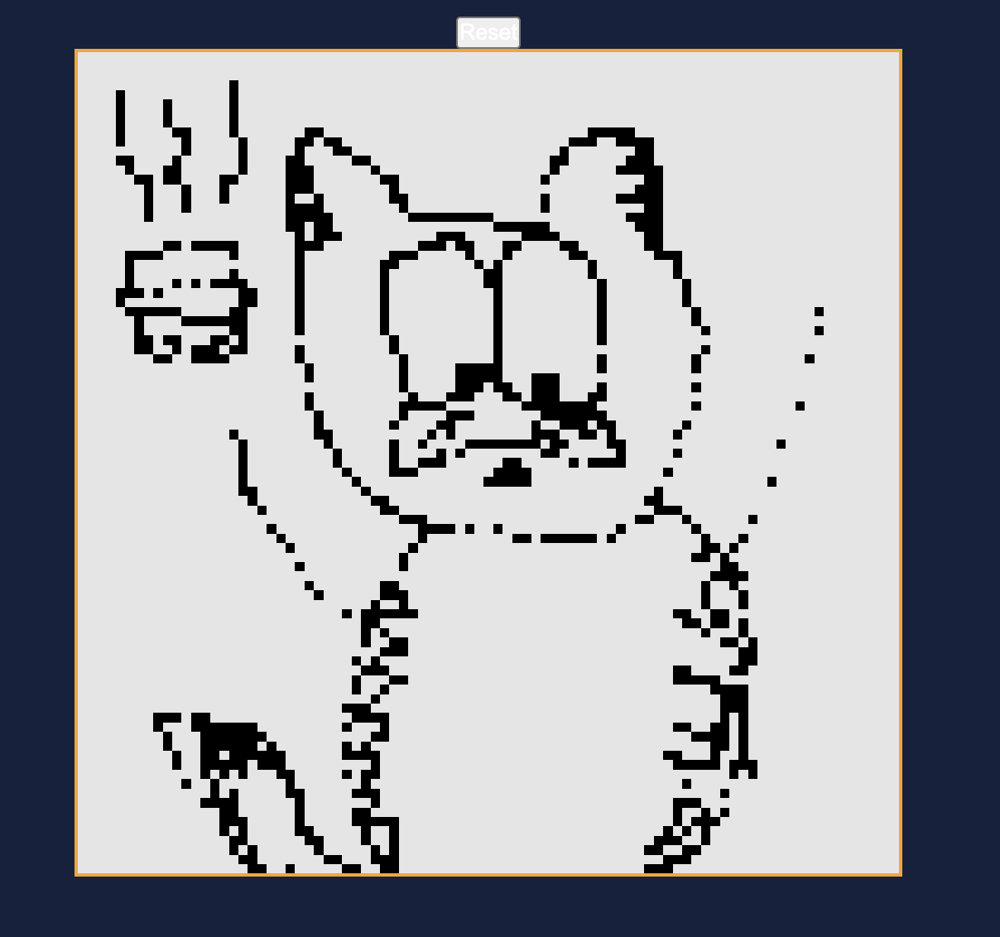
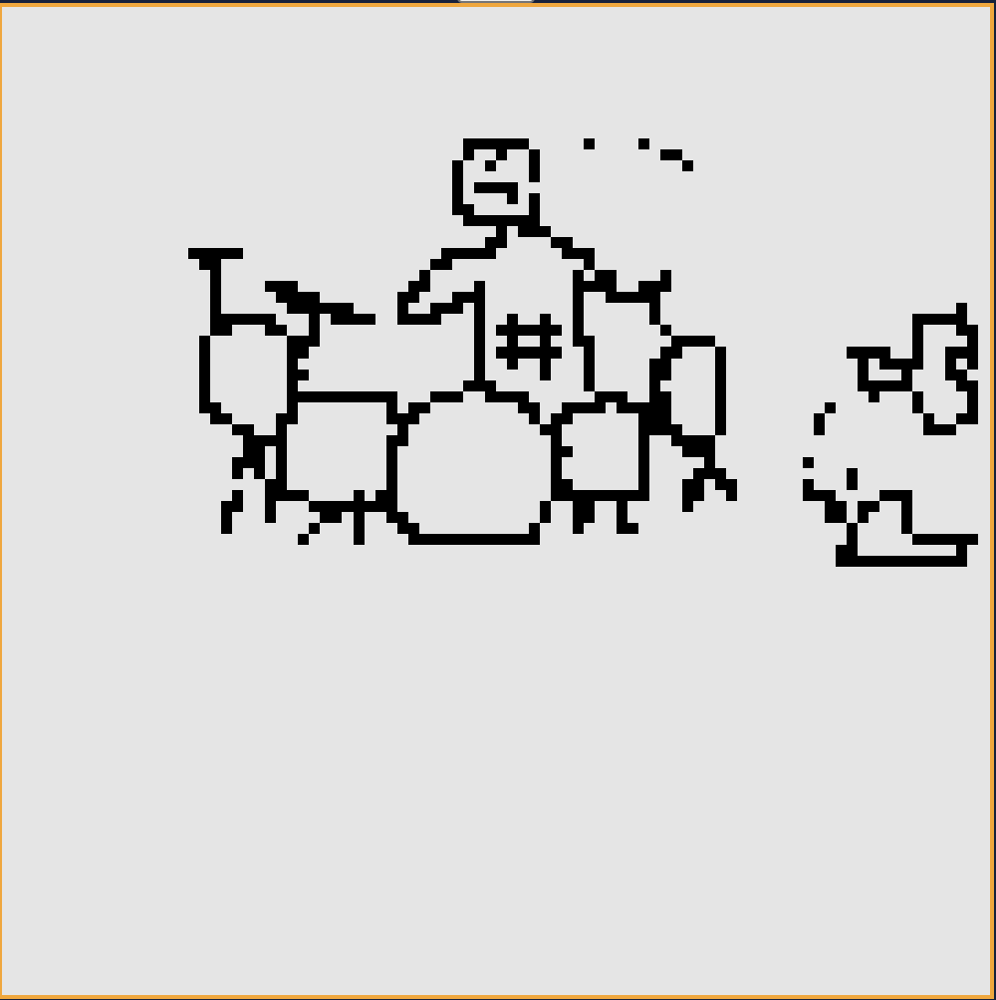
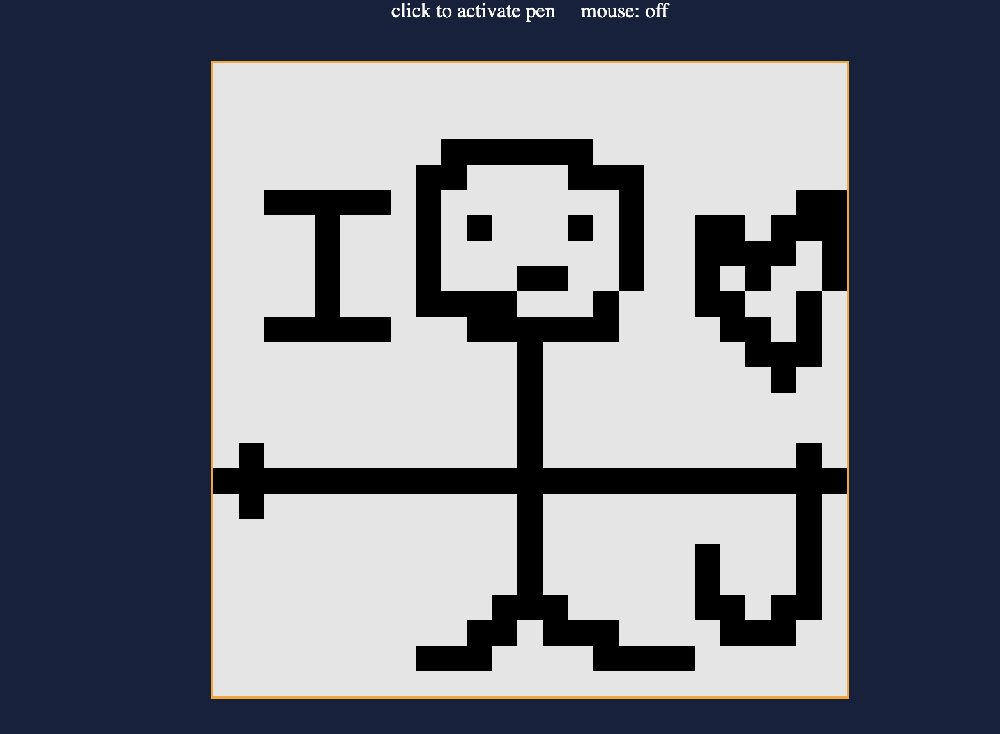

# Etch a Sketch!

This is my fourth project for the Odin Project introducing me to some higher level problems and some cool features I have learned.
I belive this project went well and taught me some new things such as code optimisations, --webkit, and range inputs.

Images created with this:

